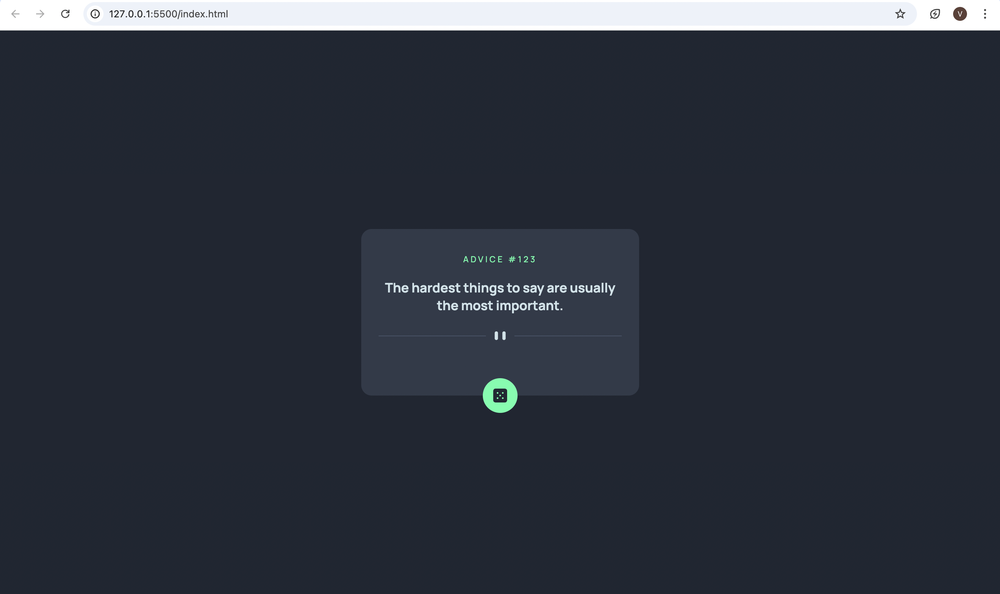

# Frontend Mentor - Advice generator app solution

This is a solution to the [Advice generator app challenge on Frontend Mentor](https://www.frontendmentor.io/challenges/advice-generator-app-QdUG-13db). Frontend Mentor challenges help you improve your coding skills by building realistic projects.

## Table of contents

- [Overview](#overview)
  - [The challenge](#the-challenge)
  - [Screenshot](#screenshot)
  - [Links](#links)
- [My process](#my-process)
  - [Built with](#built-with)
  - [Continued development](#continued-development)
- [Author](#author)
- [Acknowledgments](#acknowledgments)

## Overview

The challenge is to build out this advice generator app using the [Advice Slip API](https://api.adviceslip.com) and get it looking as close to the design as possible.

### The challenge

Users should be able to:

- View the optimal layout for the app depending on their device's screen size
- See hover states for all interactive elements on the page
- Generate a new piece of advice by clicking the dice icon

### Screenshot

### Links

- Solution URL: [Add solution URL here](https://github.com/Vaishnavi2206/advice-generator-app-main)
- Live Site URL: [Add live site URL here](https://grand-khapse-a4f0b0.netlify.app/)

## My process

1. I created a repository on [GitHub](https://github.com/) as a public project. This makes it easier to share my code with the community if I need help. I reviewed the [Try Git resource](https://try.github.io/) to ensure I set it up correctly.

2. I configured my repository to publish my code to a web address. This is useful for sharing the URL of my project along with my repo URL if I need assistance. I explored various methods and chose the best one for my project.

3. I examined the designs to start planning how to approach the project. This helped me think about the CSS classes I’d need and how to create reusable styles.

4. I structured my content with HTML before adding any styles. Focusing on the HTML first ensured my content was well-organized and ready for styling.

5. I wrote the base styles for the project, including general content styles like `font-family` and `font-size`.

6. I started adding styles from the top of the page and worked my way down, making sure to complete each section to my satisfaction before moving on to the next one.

### Built with

- Semantic HTML5 markup
- CSS custom properties
- Flexbox
- CSS Grid
- Mobile-first workflow
- Javascript

### Continued development

Modern CSS, React

## Author

- Website - Vaishnavi
- Frontend Mentor - [@Vaishnavi2206](https://www.frontendmentor.io/profile/Vaishnavi2206)

## Acknowledgments

Mdn Docs (https://developer.mozilla.org/en-US/)
